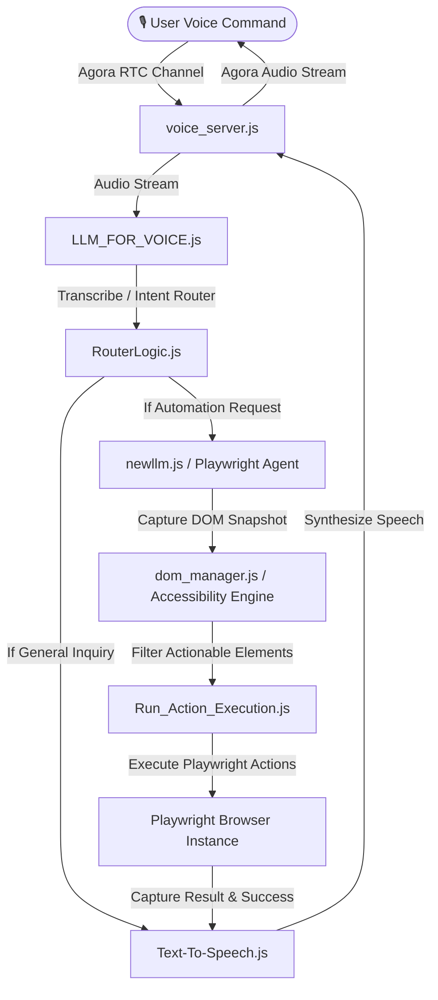

# 👁️ ARGUS (Advanced RAG & Voice-Controlled Browser Automation)

An advanced, real-time voice-controlled browser automation assistant. ARGUS integrates **Agora RTC Voice Channels**, **Playwright Automation**, **Model Context Protocol (MCP)**, **Semantic Caching**, and **Google Sheets Data Pipelines** into a unified agentic system.

---

## 🚀 Key Features

* **🎙️ Real-Time Voice Interface**: Live audio streaming via **Agora RTC SDK** to speak instructions to the agent and receive spoken verbal feedback.
* **🤖 Playwright Browser Automation**: Translates natural language/voice instructions into executable Playwright JS scripts in real-time.
* **🧬 WAI-ARIA Accessibility-First Parser**: Captures and parses the DOM, filtering out structural clutter to expose only interactive elements (buttons, search boxes, etc.) for high-precision, low-token LLM navigation.
* **🧩 Model Context Protocol (MCP) Server**: Implements a dedicated MCP server orchestrating human-in-the-loop checks, multi-field form completion, and tool execution.
* **⚡ Semantic Caching Layer**: Utilizes an in-memory/Redis Jaccard-similarity semantic caching engine to instantly serve previously translated actions, cutting API costs and execution latency.
* **📊 Google Sheets Data Pipeline**: Automatic LLM-based data cleaning for scraped data, pushing clean JSON payloads directly to Google Sheets via Google Apps Script.

---

## 📐 System Architecture

The following diagram illustrates how user voice inputs flow through the system to execute browser actions and return voice feedback:



---

## 📂 Project Structure

```bash
├── voice/                          # Agora Voice Interface & TTS Engine
│   ├── AGORAChannel.js             # Agora connection handler
│   ├── AutoNavigation.js           # Voice-prompted auto-navigation integration
│   ├── LLM_FOR_VOICE.js            # LLM interface for processing voice prompts
│   ├── RouterLogic.js              # Classifies incoming voice intents
│   ├── Text-To-Speech.js           # Audio synthesis (Nvidia NIM / Resemble.AI)
│   ├── PublishAUDIO.js             # Audio streaming publisher
│   ├── receiver.html               # Frontend dashboard for voice status
│   └── voice_server.js             # Express server hosting the voice websocket gateway
│
├── MCP_TYPE/                       # Model Context Protocol & Orchestration
│   ├── MCP_Server.js               # Main MCP Server instance
│   ├── LLM_oracastration.js        # Split complex user goals into sub-tasks
│   ├── LLM_FOR_NAVIGATING.js       # Playwright code generator for page navigation
│   ├── LLM_FOR_BOOKINGS.js         # Playwright code generator for transaction/booking flows
│   ├── Navigation_Handeler.js      # Orchestrates browser actions based on LLM outputs
│   └── HumanInTheLoop.js           # Intercepts critical actions for user validation
│
├── DOM_ACCESSBILITY/               # Accessibility Tree & DOM Snapshot Engine
│   ├── dom_manager.js              # Injects client-side scripts to scan the page
│   ├── Capturing_DOM_Snapshot.js   # Pulls structural representation of target pages
│   ├── Extract_Accessbility_roles. # Isolates actionable buttons, inputs, links
│   └── Run_Action_Execution.js     # Validates and executes Playwright scripts
│
├── Redis_Query_caching/            # Semantic Caching Layer
│   ├── Semantic_Cache.js           # Fallback Jaccard-similarity semantic cache
│   └── QueryEmbedding.js           # Utility to fetch query embeddings
│
├── DATA_Extracting_System/         # Web Scraping & Data Export Pipeline
│   ├── JSON_TO_GSHEETS.js          # Google Apps Script sheets connector
│   └── LLM_FOR_DATA_CLEANING.js    # Sanitizes raw scraped HTML into structured JSON
│
├── WEBSCRAPING/                    # Scraper Scripts
│   ├── amazonScraper.js            # Target scraper implementation for Amazon
│   └── scraper.js                  # Generic scraper launcher
│
├── commanding.html                 # Main Admin Web UI dashboard
├── server.js                       # Primary Web server and browser orchestrator
└── playwright.config.js            # Playwright testing configuration
```

---

## ⚙️ Configuration (.env)

The project uses localized configuration across components. Create a `.env` file in the **root** folder and in **module directories** (e.g., `Controlled_By_LLM/`, `DATA_Extracting_System/`) using the variables below:

```ini
# --- LLM API Settings ---
NVIDIA_API_KEY=your_nvidia_nim_api_key_here
GEMINI_API_KEY=your_gemini_api_key_here

# --- Agora RTC Voice Settings ---
AGORA_APP_ID=your_agora_app_id_here
AGORA_PRIMARY_CERTIFICATE=your_agora_primary_certificate_here

# --- Google Sheets Export Pipeline ---
GOOGLE_SHEET_API=your_google_sheets_api_key_here
GOOGLE_SHEETS_WEBAPP_URL=https://script.google.com/macros/s/.../exec

# --- Optional caching ---
REDIS_URL=redis://localhost:6379
```

---

## 🛠️ Setup & Execution

### 1. Install Dependencies
Make sure you have Node.js installed, then run:
```bash
npm install
```

### 2. Configure Playwright Browsers
Install the required browser binaries for Playwright:
```bash
npx playwright install chromium
```

### 3. Launch the Backend Server
Start the browser orchestrator and web admin console:
```bash
node server.js
```
*Accessible at `http://localhost:3000` (or the port defined in your configuration).*

### 4. Launch the Voice Gateway Server
In a separate terminal, launch the Agora voice receiver server:
```bash
node voice/voice_server.js
```

### 5. Launch the MCP Server
To enable advanced orchestration and Human-in-the-Loop workflows, run the MCP instance:
```bash
node MCP_TYPE/MCP_Server.js
```

---

## 🛡️ License

This project is licensed under the MIT License. See the LICENSE file for details.
