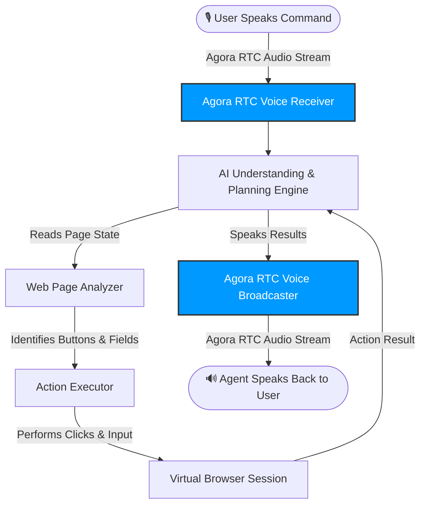

# 👁️ ARGUS: Agora-Powered Voice Web Assistant

ARGUS is an intelligent, voice-controlled web assistant designed to make web browsing and online tasks entirely hands-free. Powered by **Agora RTC**, users can command the assistant to navigate websites, search for items, extract information, and automate complex online tasks simply by speaking.

---

## 🚀 Key Features

* **🎙️ Agora RTC Real-Time Voice**: Leverages **Agora RTC SDK** for ultra-low latency audio streaming, enabling you to speak commands to the assistant and receive spoken, verbal feedback in real-time.
* **🤖 Automatic Browser Actions**: Converts spoken commands into precise actions on the screen (such as typing, searching, and clicking).
* **🧠 Smart Element Finder**: Automatically reads and analyzes the structure of active web pages, focusing only on interactive elements to ensure speed and accuracy.
* **⚡ Smart Workflow Memory**: Remembers previously executed workflows to speed up repeat tasks and reduce response delays.
* **📊 Spreadsheet Data Exporter**: Automatically cleans and structures gathered web data, saving it directly to cloud spreadsheets for you.
* **🔒 Human-in-the-Loop Safeguards**: Intercepts critical actions (like making payments or final bookings) to ask for user validation before proceeding.

---

## 📐 How It Works (Agora Integration Architecture)

The assistant operates in a continuous loop, powered by **Agora RTC** for the audio ingestion and broadcast pipeline:



### 1. Speak (Agora RTC Audio Stream In)
You speak a command (e.g., *"Search for a black leather wallet under $50"*). The **Agora RTC Voice Channel** captures your audio and streams it with sub-second latency to the voice receiver.

### 2. Think (AI Planning)
The AI brain processes your request, determines what needs to be done, and breaks down the goal into a series of smaller steps.

### 3. Parse (Web Page Analysis)
The page analyzer scans the current web page, identifying all links, input fields, and buttons, discarding background noise to focus only on parts of the page that can be interacted with.

### 4. Act (Execution)
The action engine executes the clicks, scroll actions, or keyboard entries on the virtual browser screen.

### 5. Respond (Agora RTC Audio Stream Out)
Once the task is complete, the AI response is converted into audio and broadcasted back to you over the **Agora RTC Voice Channel** for real-time verbal feedback.

---

## 📂 Project Structure

For developers working on this project, here is how the modules are organized:

```bash
├── voice/                          # Agora RTC voice receiving, routing, and broadcaster
├── MCP_TYPE/                       # AI task planning, tool handlers, and navigation controllers
├── DOM_ACCESSBILITY/               # Web page analyzer and element parsing system
├── Redis_Query_caching/            # Workflow memory and semantic cache engine
├── DATA_Extracting_System/         # Data cleaning and spreadsheet exporter
├── WEBSCRAPING/                    # Scraper targets and data collection scripts
├── commanding.html                 # Main admin dashboard interface
└── server.js                       # Primary application orchestrator
```

---

## ⚙️ Configuration (.env)

Set up a `.env` file in the root folder with your specific API endpoints and credentials:

```ini
# Central AI APIs
AI_API_KEY=your_ai_api_key

# Agora RTC Voice Credentials
AGORA_APP_ID=your_agora_app_id
AGORA_PRIMARY_CERTIFICATE=your_agora_primary_certificate

# Spreadsheet Integrations
SPREADSHEET_EXPORT_URL=your_spreadsheet_webhook_url
```

---

## 🛠️ Setup & Execution

### 1. Install Dependencies
Make sure you have Node.js installed, then run:
```bash
npm install
```

### 2. Configure Virtual Browsers
Initialize the virtual browser execution environment:
```bash
npx playwright install chromium
```

### 3. Launch the Application
Start the primary application orchestrator:
```bash
node server.js
```

### 4. Launch the Agora Voice Gateway
In a separate terminal, launch the Agora voice receiver gateway:
```bash
node voice/voice_server.js
```
